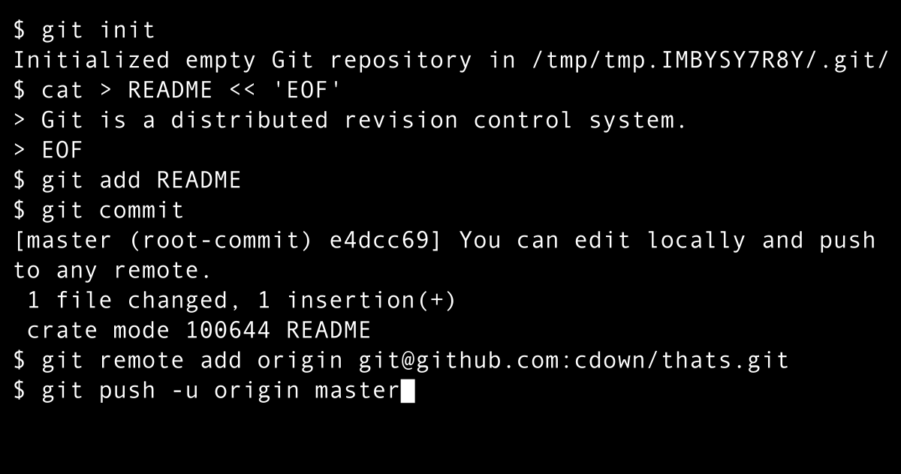

# Lab 2

In this lab, we were introduced to working with and using Git. 

I created a new JavaScript Node.js file and used Git to manage it. I learned to initialize a new Git repository using the git init command within a folder. 

Another step that I became familiar with using Git is the Git repository. Beyond the basic functiosn I learned that when files are added to a Git repo, they initially fall under the "untracked" category. 

